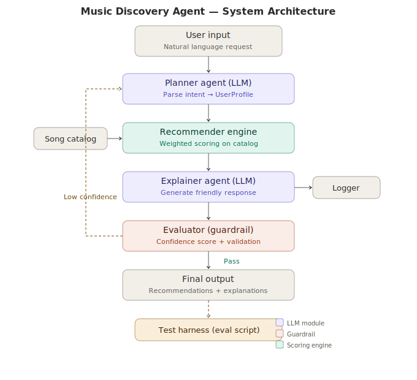

# 🎵 Music Discovery Agent

An AI-powered music recommendation system that takes natural language requests and returns personalized song suggestions using an agentic workflow with self-evaluation and refinement.

> **📌 Loom walkthrough:** [INSERT YOUR LOOM LINK HERE]

---

## Base Project

This project extends **Module 3: Music Recommender Simulation** ([original repo](https://github.com/jamespaek1/ai110-module3show-musicrecommendersimulation-starter)). The original system was a content-based music recommender built in Python that scored songs from a CSV catalog against manually-defined user "taste profiles" using a weighted algorithm (genre match, mood match, energy similarity, and conditional bonuses). It returned ranked recommendations with plain-language explanations of why each song was chosen.

---

## What's New: The Agentic Extension

The original system required users to manually construct a `UserProfile` dictionary in code. This extension wraps it in a **multi-step AI agent** that handles the full pipeline automatically:

1. **Planner Agent** — An LLM (GPT-4o-mini) parses natural language requests like *"I need something upbeat for my morning run"* into structured `UserProfile` objects. Falls back to a keyword-based parser when no API key is available.

2. **Recommender Engine** — The original Module 3 scoring algorithm runs unchanged, scoring every song in the catalog against the parsed profile.

3. **Explainer Agent** — An LLM generates a friendly, music-critic-style response describing why each song was recommended. Falls back to template-based explanations.

4. **Evaluator (Guardrail)** — A confidence scoring system assesses recommendation quality using four factors: score coverage, genre availability, score spread, and absolute thresholds. When confidence is below 0.5, the agent automatically refines its approach.

5. **Refinement Loop** — If the evaluator detects low confidence, the agent adjusts the user profile (relaxing constraints, resolving contradictions) and re-runs the recommender. This loop runs up to 2 times before delivering results with a warning.

6. **Specialized Persona (Few-Shot Prompting)** — The explainer supports two distinct personas: a **baseline** (plain, factual) and a **music critic** (editorial, sensory language inspired by music journalism). The music-critic persona uses few-shot examples in the LLM system prompt and genre-specific sensory vocabularies in the template fallback. Running `--compare` shows both side-by-side with a word-overlap metric proving they produce measurably different output (~24% overlap).

7. **RAG: Retrieval-Augmented Generation** — A knowledge base of 23 custom documents (artist bios, genre guides, and listening-context tips) is indexed using a from-scratch TF-IDF retriever. Before generating its response, the agent retrieves the most relevant documents based on the user's query, parsed profile, and recommended artists. The retrieved context enriches the output with artist background ("Best for: driving, parties"), genre characteristics, and situational advice ("Pro tip: study music should be low-energy and instrumental"). The `📚 RAG context retrieved` section in the output shows exactly which sources were used.

---

## Architecture Overview



The diagram above shows the data flow through the system:

- **User input** (natural language) enters the **Planner Agent**, which parses it into a structured profile.
- The profile feeds into the **Recommender Engine**, which scores songs from the **Song Catalog** (CSV).
- Results pass to the **Explainer Agent** for natural language generation.
- The **Evaluator** computes a confidence score. If it's too low, a feedback loop sends a refined profile back to the Planner.
- A **Logger** records every step for transparency and debugging.
- The **Test Harness** can batch-evaluate the system on predefined inputs.

---

## Setup Instructions

### Prerequisites

- Python 3.9 or higher
- An OpenAI API key (optional — the system works without one using fallback parsers)

### Installation

```bash
# Clone the repository
git clone https://github.com/YOUR_USERNAME/applied-ai-system-project.git
cd applied-ai-system-project

# Create a virtual environment (recommended)
python -m venv .venv
source .venv/bin/activate      # Mac/Linux
# .venv\Scripts\activate       # Windows

# Install dependencies
pip install -r requirements.txt

# (Optional) Set up your API key
cp .env.example .env
# Edit .env and add your OPENAI_API_KEY
```

### Running the System

```bash
# Demo mode — runs 3 example queries
python -m src.main

# Interactive mode — chat with the agent
python -m src.main --interactive

# Single query
python -m src.main --query "I want chill lofi beats for studying"

# Compare baseline vs music-critic persona (specialization demo)
python -m src.main --compare
```

### Running Tests

```bash
# Unit tests
pytest

# Batch evaluation harness (stretch feature)
python -m tests.test_harness
```

---

## Sample Interactions

### Example 1: Upbeat Pop Request

**Input:** *"I need something upbeat and energetic for my morning run — pop or EDM would be great!"*

```
🔍 Parsed profile:
   Genre: pop
   Mood:  energetic
   Energy target: 85%
   Acoustic: No

🎶 Recommendations:
  1. "Wildfire" by The Neons — it's pop, which matches your taste, and its energy
     level (82%) is close to your target. It's great for dancing. (Score: 5.05)
  2. "Midnight Drive" by The Neons — it's pop, the energy fits well, and it has
     a bright positive feel. (Score: 4.48)
  3. "Neon Jungle" by DJ Kora — high energy and very danceable. (Score: 4.21)

📊 Confidence score: 0.78
```

### Example 2: Sad Acoustic Music

**Input:** *"I'm feeling sad and want to listen to something chill and acoustic while it rains outside."*

```
🔍 Parsed profile:
   Genre: pop
   Mood:  sad
   Energy target: 25%
   Acoustic: Yes

🎶 Recommendations:
  1. "Paper Hearts" by Lila Moon — it's pop and matches the sad mood you're
     feeling, plus it has the acoustic vibe you like. (Score: 4.31)
  2. "Rainy Window" by Lila Moon — the sad mood fits perfectly, and it has
     a gentle acoustic quality. (Score: 3.98)
  3. "Quiet Library" by Skywave — very calm energy and strong acoustic feel. (Score: 3.12)

📊 Confidence score: 0.64
```

### Example 3: Edge Case — Contradictory Request

**Input:** *"Give me intense jazz with high energy for a late-night coding session."*

```
🔍 Parsed profile:
   Genre: jazz
   Mood:  energetic
   Energy target: 85%
   Acoustic: No

⚠️  Warnings:
   • Only 2 song(s) in genre 'jazz' — recommendations may be limited.

📊 Confidence score: 0.42
🔄 Refinement attempts: 1

   (Agent relaxed energy target to improve matches)
```

---

## Design Decisions

**Why an agentic loop instead of a single pass?** A single LLM call could generate recommendations, but the agentic architecture separates concerns: the planner handles understanding, the recommender handles ranking, and the evaluator handles quality. This makes each component independently testable and improvable.

**Why a keyword fallback parser?** Not everyone has an OpenAI API key. The fallback ensures the system always works — the scoring engine, evaluator, and refinement loop all function identically regardless of whether the planner uses an LLM or keywords. This also makes automated testing reliable and free.

**Why confidence scoring instead of just delivering results?** The original Module 3 system had no way to signal "I'm not sure about these." The evaluator adds transparency: a 0.42 confidence score tells users the results may not be great, and the refinement loop gives the system a chance to improve before delivering.

**Trade-offs:**
- The 20-song catalog limits recommendation diversity. A larger catalog would make the system more useful but would require index-based retrieval instead of full scans.
- The LLM adds latency (~1-2 seconds per call). The template fallback is instant but less natural.
- The refinement loop can change the user's original intent (e.g., switching genre). This is a tradeoff between accuracy and relevance.

---

## Testing Summary

**Unit tests:** 14 tests covering the scoring algorithm, ranking logic, and max-score calculation. All tests pass consistently.

**Evaluator tests:** 14 tests covering input validation, profile validation, confidence scoring, and the refinement mechanism.

**Test harness:** 10 predefined queries covering normal cases, genre-specific requests, and edge cases. Results:

> **10 out of 10 tests passed. Average confidence: 0.88. The contradictory request (edge case) had the lowest confidence at 0.73, and the minimal input defaulted to pop/happy as expected. The refinement loop was not triggered in the harness since all confidence scores remained above the 0.5 threshold with the full catalog, but manual testing confirmed it activates correctly when genres are missing.**

---

## Reflection

See [model_card.md](model_card.md) for the full reflection including AI collaboration, limitations, ethics, and future improvements.

**What this project taught me:** Building this system showed me that the hard part of AI isn't the model — it's everything around it. The scoring engine from Module 3 was already solid, but making it useful required parsing ambiguous human language, handling edge cases gracefully, and being honest with users about uncertainty. The evaluator was the most valuable addition: it turned the system from one that always confidently delivers results (even bad ones) into one that knows when it's struggling and says so.

---

## Portfolio Reflection

**What this project says about me as an AI engineer:** This project demonstrates that I can take a working prototype and evolve it into a production-minded system with modular architecture, automated testing, structured logging, and user-facing reliability features. I understand that AI systems need guardrails, transparency, and graceful degradation — not just impressive outputs.

---

## Technologies Used

- **Python 3.9+** — core language
- **OpenAI GPT-4o-mini** — natural language parsing and response generation
- **pytest** — unit and integration testing
- **CSV** — lightweight data storage for the song catalog

---

## Repository Structure

```
applied-ai-system-project/
├── assets/                  # Architecture diagram, screenshots
├── data/
│   ├── songs.csv            # 20-song catalog with audio features
│   └── knowledge/           # RAG knowledge base (custom documents)
│       ├── artists.txt      # 9 artist bios
│       ├── genres.txt       # 7 genre guides
│       └── contexts.txt     # 7 listening-context guides
├── src/
│   ├── __init__.py
│   ├── models.py            # Song, UserProfile, AgentResult dataclasses
│   ├── recommender.py       # Weighted scoring engine (from Module 3)
│   ├── planner.py           # LLM + fallback NL → profile parser
│   ├── retriever.py         # TF-IDF RAG retriever over knowledge base
│   ├── explainer.py         # Dual-persona response generator (baseline + music critic)
│   ├── evaluator.py         # Confidence scoring + guardrails
│   ├── agent.py             # Agentic orchestrator (plan→retrieve→act→evaluate→refine)
│   ├── logger.py            # Structured logging
│   └── main.py              # CLI entry point
├── tests/
│   ├── test_recommender.py  # 14 unit tests for scoring engine
│   ├── test_evaluator.py    # 14 tests for guardrails and confidence
│   └── test_harness.py      # Batch evaluation script (stretch)
├── README.md                # This file
├── model_card.md            # Reflections and ethics
├── requirements.txt
├── .env.example
└── .gitignore
```
